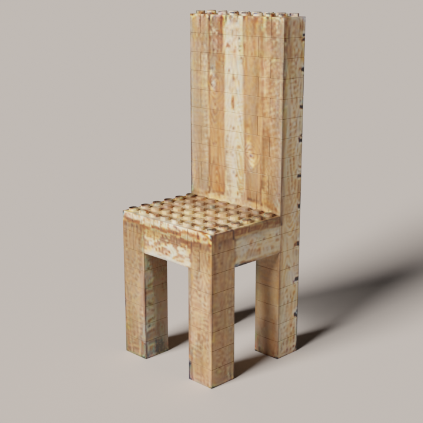
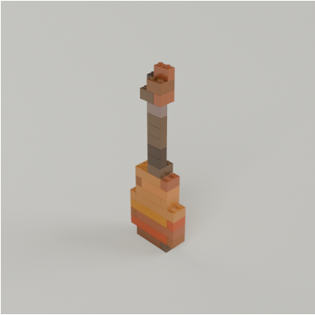

# Textured and Colored LEGO Model Generation

This subdirectory contains the code for generating the UV texture or per-brick color given a LEGO design.

## Getting Started

### Dependencies

In addition to the dependencies required by the main repo, this project requires the following extra dependencies:

1. **FlashTex and blender-render-toolkit.** These are provided as Git submodules; install them with
   `git submodule update --init`.
2. **Additional Python dependencies.** Run
   `uv sync --extra build && uv sync --extra compile` to create a Python virtual environment with all
   dependencies installed.

---

### Textured LEGO Model Generation

Given a LEGO LDR file and a text prompt as input, generate the UV texture for it.

```zsh
INPUT="./examples/chair.ldr"     # Input LDR file
OUTPUT="./out/chair"             # Output dir
TXT_PROMPT="Rustic farmhouse armchair built from reclaimed wood, showing pixelated grain patterns and warm distressed textures, best quality, hd"                        # Text Prompt

uv run scripts/generate_texture.py "${INPUT}" "${OUTPUT}" "${TXT_PROMPT}"
```

The generated UV texture map will be saved to `./out/chair/texture_output/texture_kd.png` along with the mesh
`./out/chair/texture_output/output_mesh.obj` and material `./out/chair/texture_output/output_mesh.obj`. Meanwhile, you
can check the rendered image `./out/chair/texture_render/output_mesh_full_color.png`



### Colored LEGO Model Generation

Given a LEGO txt file and a text prompt as input, colorize each brick.

```zsh
INPUT="./examples/guitar.txt"     # Input Text file
OUTPUT="./out/guitar"             # Output dir
TXT_PROMPT="Parlor guitar with ladder bracing, folk revival design, best quality, hd"                        # Text Prompt

uv run scripts/generate_color.py "${INPUT}" "${OUTPUT}" "${TXT_PROMPT}"
```

The generated colored LEGO model will be saved to `./out/guitar/colored_brick.ldr`. Check the rendered image
`./out/guitar/rendered_color.png`.

